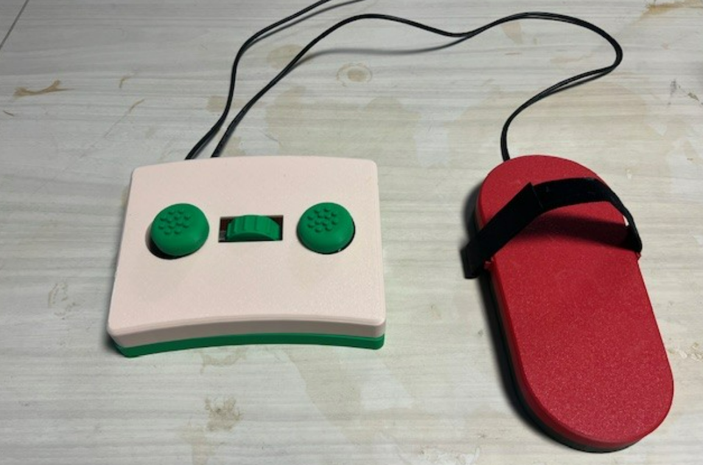

# Hands-Free Mouse for Sally

## Overview
This project provides a hands-free mouse system designed for Sally Rogow, a planning and grants manager at CAPSLO who has bilateral epicondylitis (tennis elbow). The system replaces a discontinued commercial Footime mouse with a custom solution that enables comfortable computer use without hand strain.

The device consists of two main components:
1. **Base Unit** - Handles mouse clicks and scrolling functionality
2. **Foot Mouse** - Controls cursor movement via foot motion

## Project Background
Sally has bilateral epicondylitis, a condition that weakens grip strength, impacts fine motor skills, and causes radiating pain. This project was developed by the EMPOWER Student Association to create an accessible mouse alternative that doesn't require hand movement.

## Features
- Left and right click functionality via foot-operated buttons
- Smooth cursor control with optical tracking sensor
- Scrolling capability through a dedicated scroll wheel
- USB connection for plug-and-play operation
- Ergonomic design for extended comfortable use

## Components

### Base Subsystem
- **Hardware**:
  - Arduino Leonardo microcontroller
  - Push button switches for left/right clicks
  - Rotary encoder for scrolling
  - 3D printed enclosure with hinged lid for easy access
  - Breadboards and wiring

- **Features**:
  - Easy-to-press buttons for clicking
  - Intuitive scroll wheel
  - Maintenance-friendly design with accessible internals

### Mouse Subsystem
- **Hardware**:
  - Arduino Leonardo microcontroller
  - PMW3360 optical sensor
  - Foam insole and elastic strap for comfort
  - 3D printed housing

- **Features**:
  - Precise cursor movement
  - Comfortable foot attachment
  - Adjustable sensitivity

## Getting Started

### Prerequisites
- Arduino IDE
- SPI.h library
- Mouse.h library

### Assembly Instructions
1. 3D print all components using provided STL files
2. Assemble base unit by inserting hinge pin into slots
3. Install buttons and rotary encoder on breadboards
4. Connect all components according to wiring diagram
5. Upload Arduino code
6. Connect via USB and test functionality

For detailed assembly instructions, see [Assembly_Instructions.pdf](./Assembly Instructions.pdf)

## Software

### Base Unit Code
The base unit software handles:
- Button press detection for left/right clicks
- Rotary encoder input for scrolling
- USB mouse interface

### Foot Mouse Code
The foot mouse software handles:
- Optical sensor tracking via SPI
- Motion detection and processing
- Sensitivity adjustments

## Project Development

This project was developed by the EMPOWER (Endeavors to Move People Onwards With Engineered Results) Student Association at California Polytechnic State University. Development occurred over three academic quarters with the following timeline:

- **Fall Quarter**: User requirements, preliminary design, research
- **Winter Quarter**: Prototyping, component testing, design refinements
- **Spring Quarter**: Final assembly, testing, and delivery

## Team Members
- Alex Herman
- Jessica Hu
- Kris Huang
- Vincent Pecoraro
- Mercy Rangel-Lopez
- Sandhya Sridhar (Lead)
- Kaitlyn Terry

## License
This project is open-source and part of the Global Innovation Challenge in collaboration with Tikkun Olam Makers (TOM).

## Acknowledgments
- CAPSLO (Community Action Partnership of San Luis Obispo)
- TECHE, Mustang 60, and Hangar labs for manufacturing support

## Contact
For questions or support, please contact cpempowerops@gmail.com
